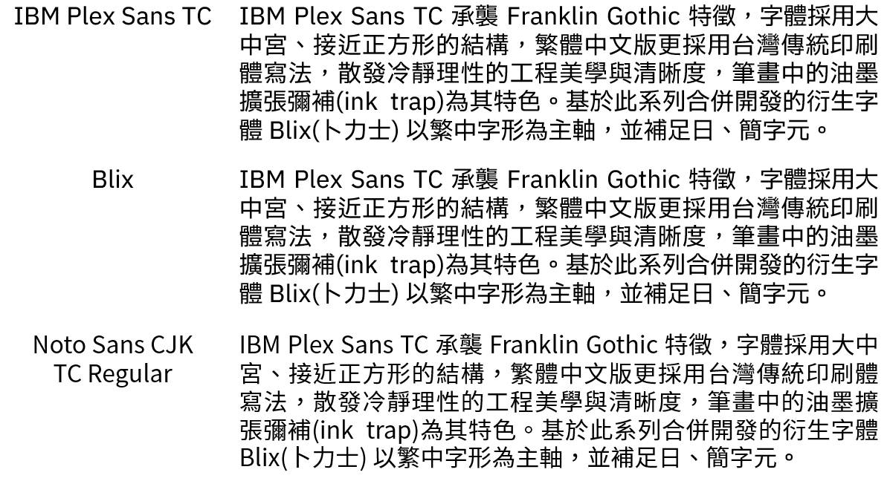

# Blix and IBM Plex Sans TC-derived PowerPoint / PDF Compatibility Fix

[繁體中文 README](README.md)

This repository provides PowerPoint-compatible TrueType builds of
**Blix (卜力士)** and **IBM Plex Sans TC-derived fonts**. Blix is a renamed
derivative of IBM Plex Sans TC.

These builds fix an issue where the fonts displayed correctly in PowerPoint,
but Traditional Chinese characters became square boxes after PDF export. They
also improve font embedding, PDF subsetting, and Windows font-cache
compatibility.

## Typeface Comparison



The image compares IBM Plex Sans TC, Blix, and Noto Sans CJK TC Regular using
the same text. Blix retains IBM Plex Sans TC's calm, clear engineering
character and near-square Chinese proportions while focusing on Traditional
Chinese glyph forms.

## Project Rationale

The original IBM Plex Sans TC TTF files used in this project could cause
character-display errors when creating PowerPoint presentations. Some files
appeared correct in the PowerPoint editor, but Traditional Chinese characters
could become square boxes, disappear, or be substituted with another system
font when the presentation embedded fonts, was opened on another computer, or
was exported to PDF. Blix, developed as a derivative and merged build of IBM
Plex Sans TC, inherited the same issue.

Investigation showed that the affected fonts contained complete Unicode
format-12 mappings, while the Windows BMP `cmap` format-4 mappings were empty.
PowerPoint's editing view could still display text through another Unicode
mapping or font-substitution path. However, Office font embedding, PDF export,
and font-subsetting workflows may rely on format 4, preventing Chinese
characters from mapping correctly to glyphs.

This project therefore does not redesign the glyphs. It preserves the original
outlines, metrics, and design characteristics while repairing Unicode mappings,
embedding-related metadata, PDF weight metadata, version identifiers, and
checksums so the fonts work reliably in presentations, cross-device sharing,
and PDF output.

## Downloads

### Blix

The eight repaired Blix weights are available in [`fonts/Blix`](fonts/Blix):

- Blix Thin
- Blix ExtraLight
- Blix Light
- Blix Regular
- Blix Text
- Blix Medium
- Blix SemiBold
- Blix Bold

### Public IBM Plex Sans TC-derived Fix

The eight repaired IBM Plex Sans TC-derived weights are available in
[`fonts/IBM-Plex-Sans-TC-derived-fix`](fonts/IBM-Plex-Sans-TC-derived-fix).

Because IBM's SIL OFL agreement reserves the name `Plex`, publicly distributed
modified builds cannot retain the original internal family name. These files
therefore use the compliant new family name **PPT Sans TC Fix**:

- PPT Sans TC Fix Thin
- PPT Sans TC Fix ExtraLight
- PPT Sans TC Fix Light
- PPT Sans TC Fix Regular
- PPT Sans TC Fix Text
- PPT Sans TC Fix Medium
- PPT Sans TC Fix SemiBold
- PPT Sans TC Fix Bold

## Fixes

- Populated the previously empty Windows BMP Unicode mapping tables:
  - `cmap` platform `3`, encoding `1`, format `4`
  - `cmap` platform `0`, encoding `3`, format `4`
- Preserved the complete format-12 Unicode mappings, including non-BMP
  characters.
- Confirmed `OS/2.fsType = 0`, allowing installation and embedding.
- Normalized the nonstandard `Blix-Text` weight metadata from `450` to `400`.
- Updated font revisions and unique IDs to reduce stale Windows font-cache
  reuse.
- Recalculated TrueType checksums and validated every font table.

## Validation

The repaired builds passed:

- Windows `T2Embed.dll` full-font embedding
- Windows `T2Embed.dll` subset embedding
- PowerPoint font embedding
- PowerPoint PDF export
- PDF embedded-font inspection
- Traditional Chinese PDF text extraction

Run the included validator:

```powershell
python -m pip install fonttools
python tools/validate_fonts.py fonts
```

## Installation

1. Remove older Blix installations through Windows Settings or Control Panel.
2. Restart Windows to clear stale Office and Windows font caches.
3. Install every font in [`fonts/Blix`](fonts/Blix) or
   [`fonts/IBM-Plex-Sans-TC-derived-fix`](fonts/IBM-Plex-Sans-TC-derived-fix).
4. Enable **Embed fonts in the file** when saving a PowerPoint presentation.

## IBM Plex Sans TC

This repository includes repaired IBM Plex Sans TC-derived builds. To comply
with the Reserved Font Name clause, the public files use the internal family
name **PPT Sans TC Fix**. The original design, glyphs, and copyrights remain
with IBM and the original contributors. See the
[IBM Plex Sans TC derivative notice](LICENSES/IBM-PLEX-SANS-TC-DERIVATIVE-NOTICE.md).

## License Agreements

The applicable official agreement is the
**SIL Open Font License 1.1 (SIL OFL 1.1)**. There is no official font license
named “SLC” for IBM Plex or Blix; if “SLC” was intended to mean “SIL,” the
corresponding files are:

- [Blix SIL OFL 1.1 agreement](LICENSES/Blix-SIL-OFL-1.1.txt)
- [Blix modification notice](LICENSES/Blix-MODIFICATION-NOTICE.md)
- [IBM Plex Sans TC SIL OFL 1.1 agreement](LICENSES/IBM-Plex-Sans-TC-SIL-OFL-1.1.txt)
- [IBM Plex Sans TC derivative notice](LICENSES/IBM-PLEX-SANS-TC-DERIVATIVE-NOTICE.md)
- [IBM official original agreement](OFL.txt)

IBM's original agreement reserves the font name **Plex**. The publicly
distributed derivatives use the renamed families **Blix / 卜力士** and
**PPT Sans TC Fix**, and declare no additional Reserved Font Names.

## Project Paths

- Blix fix project: <https://github.com/MullerLi/blix-powerpoint-pdf-fix>
- Repaired Blix fonts: <https://github.com/MullerLi/blix-powerpoint-pdf-fix/tree/main/fonts/Blix>
- Official IBM Plex project: <https://github.com/IBM/plex>
- Official IBM Plex Sans TC package: <https://github.com/IBM/plex/tree/master/packages/plex-sans-tc>
- Repaired IBM Plex Sans TC-derived fonts: <https://github.com/MullerLi/blix-powerpoint-pdf-fix/tree/main/fonts/IBM-Plex-Sans-TC-derived-fix>

## Acknowledgements

Thanks to IBM, the IBM Plex design team, Bold Monday, and every IBM Plex
contributor for creating and sharing a high-quality typeface project that can
be freely used, studied, modified, and redistributed. Thanks also to the SIL
Open Font License for providing the open-font collaboration framework that
makes Blix and this compatibility repair project possible.
