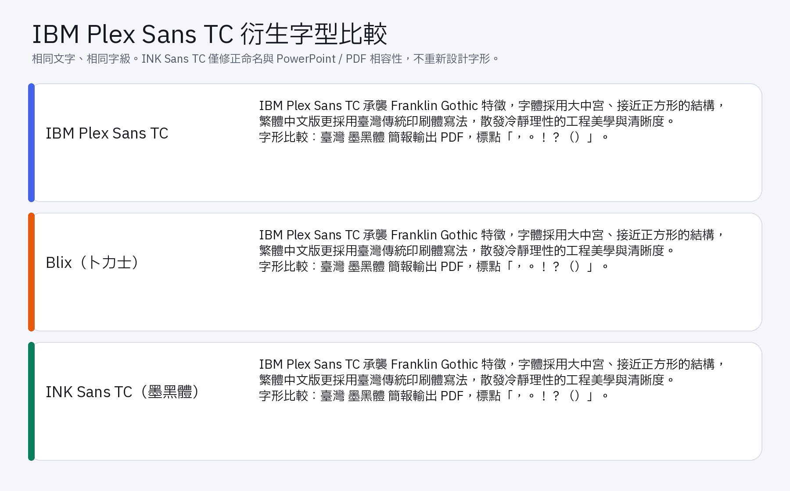

# Blix 卜力士與 IBM Plex Sans TC 來源字型 PowerPoint / PDF 相容修正版

[English README](README.en.md)

本專案提供 **Blix（卜力士）** 與 **IBM Plex Sans TC 來源字型**的 PowerPoint
相容 TrueType 修正版。Blix 源自 IBM Plex Sans TC 字型家族與
[cathree3/Plix](https://github.com/cathree3/Plix) 衍生字型專案。

本修正版解決字型在 PowerPoint 中顯示正常，但輸出 PDF 後繁體中文字元全部變成
方框的問題，並改善字型內嵌、PDF 子集化與 Windows 字型快取相容性。

## 字型比較



圖中以相同文字與字級比較 IBM Plex Sans TC、Blix 與 INK Sans TC。INK Sans TC
僅修正字型命名、Unicode 對照與簡報相容性，因此字形外觀應與來源 IBM Plex Sans
TC 相同；Blix 則是針對繁中字形與跨語系覆蓋合併開發的衍生字體。

Plix 上游 GitHub 在本圖製作時（2026 年 6 月 9 日）未提供可直接渲染的 Plix
字型檔，因此未在圖中模擬其外觀；其上游定義與差異仍完整列於下表。

## 字體差異

| 字體 | 定位與來源 | 中文字形與標點 | 本專案角色 |
| --- | --- | --- | --- |
| IBM Plex Sans TC | IBM Plex 官方繁體中文字體，是本案的原始設計與字形基準 | 以繁體中文與臺灣傳統印刷體寫法為主 | 上游原版；修改後依法不能沿用 Reserved Font Name `Plex` |
| Plix（普力士） | [cathree3/Plix](https://github.com/cathree3/Plix) 的合併字體，以 JP 補上 TC，再補上 SC | 日本字形，標點居角 | Blix 的同系列上游衍生專案；本專案未散布 Plix 字型 |
| Blix（卜力士） | Plix 專案中的繁中取向合併字體，以 TC 補上 JP，再補上 SC | 繁中字形，標點居中 | 修復既有空白 BMP `cmap`，保留 Blix 名稱與字形 |
| INK Sans TC（墨黑體） | IBM Plex Sans TC 來源的合規改名修正版 | 與來源 IBM Plex Sans TC 相同；未重新設計字形 | 修復 PowerPoint 內嵌、PDF 輸出與 Unicode 對照；不使用 Reserved Font Name `Plex` |

## 修正案案由

本案使用的原始 IBM Plex Sans TC TTF 在製作 PowerPoint 簡報時，可能出現字元
顯示錯誤。部分檔案在 PowerPoint 編輯畫面中看似正常，但在儲存內嵌字型的簡報、
跨電腦開啟，或輸出 PDF 時，繁體中文字元可能變成方框、遺失，或被替換成其他
系統字型。由 IBM Plex Sans TC 與 Plix 衍生、合併開發的 Blix 也繼承了相同
問題。

經檢查後確認，受影響字型雖然具有完整的 Unicode format 12 對照表，但 Windows
常用的 BMP `cmap` format 4 對照表是空的。PowerPoint 編輯畫面可能透過其他
Unicode 對照或字型替代機制正常顯示；然而 Office 的字型內嵌、PDF 輸出與字型
子集化流程可能讀取 format 4，導致中文字元無法正確映射至 glyph。

因此，本修正案的目的不是重新設計字形，而是在保留原始字型輪廓、排版度量與設計
特徵的前提下，修復 Unicode 對照、內嵌權限相關 metadata、PDF 字重 metadata、
版本識別與 checksum，使字型能穩定用於簡報製作、跨裝置分享與 PDF 輸出。

## 下載

### Blix

修復後的 8 個 Blix 字重位於 [`fonts/Blix`](fonts/Blix)：

- Blix Thin
- Blix ExtraLight
- Blix Light
- Blix Regular
- Blix Text
- Blix Medium
- Blix SemiBold
- Blix Bold

### INK Sans TC（墨黑體）

修復後的 8 個 IBM Plex Sans TC 來源字重位於
[`fonts/INK-Sans-TC`](fonts/INK-Sans-TC)。

由於 IBM 官方 SIL OFL 將 `Plex` 指定為 Reserved Font Name，公開散布的修改版本
依法不能繼續使用原始內部 family name。這些檔案因此使用合規的新名稱
**INK Sans TC（墨黑體）**：

名稱未採用 `INK Plex Sans TC`，因為 `Plex` 是 IBM 指定的 Reserved Font Name，
修改版本不能將它用作完整名稱或名稱的一部分。

- INK Sans TC Thin
- INK Sans TC ExtraLight
- INK Sans TC Light
- INK Sans TC Regular
- INK Sans TC Text
- INK Sans TC Medium
- INK Sans TC SemiBold
- INK Sans TC Bold

## 修復內容

- 補齊原本為空的 Windows BMP Unicode 對照表：
  - `cmap` platform `3`、encoding `1`、format `4`
  - `cmap` platform `0`、encoding `3`、format `4`
- 保留完整的 format 12 Unicode 對照，包括非 BMP 字元。
- 確認 `OS/2.fsType = 0`，允許字型安裝及內嵌。
- 將 `Blix-Text` 的非標準字重 metadata 由 `450` 正規化為 `400`。
- 更新字型版本與 Unique ID，降低 Windows 重複使用舊字型快取的機率。
- 重新計算 TrueType checksum 並驗證所有字型表格。

## 驗證結果

修復後的字型已通過：

- Windows `T2Embed.dll` 完整字型內嵌
- Windows `T2Embed.dll` 子集字型內嵌
- PowerPoint 字型內嵌
- PowerPoint 輸出 PDF
- PDF 內嵌字型檢查
- PDF 繁體中文文字抽取

可使用附帶工具再次驗證：

```powershell
python -m pip install fonttools
python tools/validate_fonts.py fonts
```

## 安裝方式

1. 從 Windows 設定或控制台移除舊版 Blix。
2. 重新啟動 Windows，以清除 Office 與 Windows 的舊字型快取。
3. 安裝 [`fonts/Blix`](fonts/Blix) 或
   [`fonts/INK-Sans-TC`](fonts/INK-Sans-TC)
   內的全部字型。
4. PowerPoint 儲存簡報時，啟用「將字型內嵌於檔案」。

## IBM Plex Sans TC

本專案已提供 IBM Plex Sans TC 來源的修正版。為遵守 Reserved Font Name 條款，
公開檔案的內部名稱已改為 **INK Sans TC（墨黑體）**；原始設計、字形與著作權仍歸 IBM
及原始貢獻者所有。詳細說明請見
[IBM Plex Sans TC 來源修改聲明](LICENSES/IBM-PLEX-SANS-TC-DERIVATIVE-NOTICE.md)。

## 授權協議

本專案使用的正式協議是 **SIL Open Font License 1.1（SIL OFL 1.1）**。
對應文件如下：

- [Blix SIL OFL 1.1 協議](LICENSES/Blix-SIL-OFL-1.1.txt)
- [Blix 衍生修改聲明](LICENSES/Blix-MODIFICATION-NOTICE.md)
- [IBM Plex Sans TC SIL OFL 1.1 協議](LICENSES/IBM-Plex-Sans-TC-SIL-OFL-1.1.txt)
- [IBM Plex Sans TC 來源修改聲明](LICENSES/IBM-PLEX-SANS-TC-DERIVATIVE-NOTICE.md)
- [IBM 官方原始協議](OFL.txt)

IBM 原始協議將 **Plex** 指定為 Reserved Font Name。本專案公開散布的衍生版本
使用重新命名後的 **Blix / 卜力士** 與 **INK Sans TC / 墨黑體**，且未新增其他
Reserved Font Name。

## 上游專案路徑

- IBM Plex 字型家族官方專案：<https://github.com/IBM/plex>
- IBM Plex Sans TC 官方套件：<https://github.com/IBM/plex/tree/master/packages/plex-sans-tc>
- Plix 衍生字型專案：<https://github.com/cathree3/Plix>

## 致謝

感謝 IBM、IBM Plex 設計團隊、Bold Monday 與所有 IBM Plex 貢獻者，提供高品質且
可自由使用、研究、修改與散布的 IBM Plex 字型專案。感謝 cathree3 與 Plix
專案，提供 Blix 衍生與合併開發的重要上游基礎。亦感謝 SIL Open Font License
建立開放字型協作的基礎，使 Blix 與本相容修正案得以延伸、驗證並公開分享。
